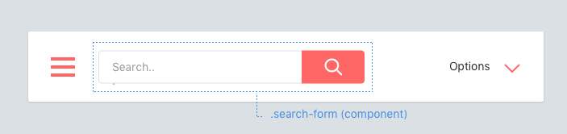

Components
==========

Think in components. Consider each piece of your UI as an individual "component".

### Naming components
Components will be named with **at least two words**, with a dash between each word. Examples of components:

  * A like button (`.like-button`)
  * A search form (`.search-form`)
  * A news article card (`.article-card`)
  * A namespaced component (`.rico-custom-header`)

Components can contain elements, and maybe other components.

How do you write a component exactly? Let's learn about Elements.
[Continue →](components/elements.md)
<!-- {p:.pull-box} -->
