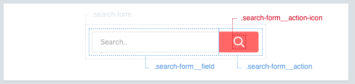

Elements
==========

Elements are things inside your component.



### Naming elements
Each component may have elements. They should have classes that are a combination of the component and the element.

```scss
.search-form { /* ... */ }
  .search-form__field { /* ... */ }
  .search-form__action { /* ... */ }
```

### Element selectors
follow the BEM naming convention of component name and element name joined with a double underscore.

```scss
.article-card {
  .title     { /* ✖️ bad */ }
}
```

* complicates the specifity weight
* ambigous use of `.title`, nesting components here could result in unintended application of styles.

```scss
.article-card {
  &__title     { /* ✖️ bad */ }
}
```

* removes the one to one parity between code in your editor and code in the browsers dev tools.


```scss
.article-card {}
.article-card__title  { /* ✔️ better */ }
```

### Avoid tag selectors
Always use class name selectors. Tag selectors should be reserved for wysiwyg rules, where they will incur a large [specificity cost](https://www.google.com.au/search?q=css+specifity+score). This is what we want, it harder for implementation specific code to override.

```scss
.article-card > h3 { /* ✖️ avoid */ }

.article-card__name { /* ✔️ better */ }
```

### Elements class names
Despite the urge to do so, element class names should not be a representation of their position in the HTML Document Object Model.

```scss
/* ✖️ bad */
.article-card {}
.article-card__header {}
.article-card__header__title {}
.article-card__header__author {}
.article-card__header__timestamp {}
```

Instead element class names merely describe what component they belong to. (without raising the [css specifity score](https://www.google.com.au/search?q=css+specifity+score)).

```scss
/* ✔️ better */
.article-card {}
  .article-card__header {}
    .article-card__title {}
    .article-card__author {}
    .article-card__timestamp {}
```

Even nested components can themselves be elements of the containing component. In [BEM, this is called a 'mix'](components/mixins.md).

```html
<div class="article-card">
  
  <div class="article-card__header">
    <h3 class="article-card__title"> <!-- ... //--> </div>
    <span class="article-card__author"> <!-- ... //--> </div>
    <div class="article-card__timestamp"> <!-- ... //--> </div>
    <a class="c-button c-button--primary article-card__link-button"
       href="..."><!-- ... //--></a>
  </div>
</div>
```

```scss
// @core/components/buttons/button.scss
.c-button { /* ... */ }
.c-button--primary { /* ... */ }
```

```scss
// @site__abc123/components/articles/article-card.scss
.article-card {}
.article-card__link-button {
  flex-grow: 0;
  align-self: flex-end;
}
```

## Avoid describing the design in HTML

```html
```

```html
/* ✖️bad */
<div class="layout"> /* 🥚 */
    <div class="row"> /* 🐤 */
        <div class="layout-content">  /* 🐔 */
            <div class="large-12 columns layout-cell"> /* 🐓 */
                ...
            </div>
        </div>
    </div>
</div>
```

```html
/* ✔️ Better */
<div class="layout"> /* 1️⃣ */
    <div class="layout__container"> /* 2️⃣ */

      <div class="layout__cell"> ... </div> /* 3️⃣ */

    </div>
</div>
```

**What's wrong?***

The bird is not the way.

 * 🥚 Starts out good, the component right?
 * 🐤 First element, it's not marked as a element of our component `layout`. superflous,
 * 🐔 Second element (which should be the first) doesn't follow BEM convention. If we're keeping the name, it should be `layout__content` but here it should be 2️⃣
 * 🐓 Third element... again doesn't follow BEM convention. should be `layout__cell` as in 3️⃣


Not all elements should always look the same. There can be variations, Modiers can help.
[Continue →](components/modifiers.md)
<!-- {p:.pull-box} -->
