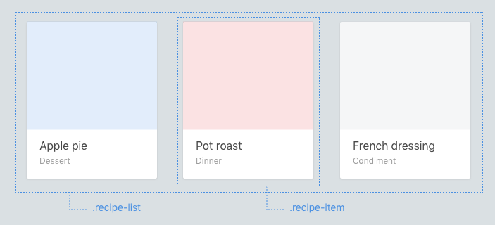

Layouts
==========

Layouts are components. Difference being Layouts are where we control positioning and page specific styles.




### Keep positioning properties for layouts

Components should be made in a way that they're reusable in different contexts. Avoid putting these properties on a components top level element:

  * Positioning (`position`, `top`, `left`, `right`, `bottom`)
  * Floats (`float`, `clear`)
  * Margins (`margin`)
  * Dimensions (`width`, `height`)

### Fixed dimensions

As indicated, the exception is that Elements and Nested Components can have positioning. However the rule still stands that Components should not have  positioning rules 1️⃣, these go on the mix classname 2️⃣.

```html
<div class="article-page">
    <div class="article-page__container">
        <header class="page-header article-page__header">
            <h2 class="page-header__heading">A heading</h2>
            <small class="page-header__meta">last edited 2010-10-01</small>
        </header>
    </div>
</div>
```


```scss
.article-page {}
.page-header { /* ✖️ bad 1️⃣ */
    margin-top: rem-calc(24px);
}
```

```scss
.article-page {}
.article-page__header { /* ✔️ good 2️⃣ */
    margin-top: rem-calc(24px);
}
```

Here positioning is an aspect of the `page` component, not the `header` component.

### Define positioning in parents

If you need to define these, try to define them in whatever context they will be in. In this example below, notice that the widths and floats are applied on the *list* component, not the component itself.

  ```css
  .article-card {
    /* ✖️ bad */
    width: 33.3%;
    float: left;
  }
  ```


  ```css
  .featured-article-list { /* ... */ }
  .featured-article-list__article-card {
    /* ✔️ better */
    width: 33.3%;
    float: left;
  }
  ```
