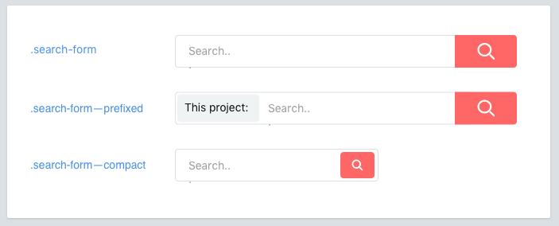

Modifiers
==========

Components may have modifiers. Elements may have modifiers, too.



<br>

## Naming modifiers
Classnames for modifiers will be prefixed by a double dash (`--`).

```scss
  .like-button { /* ... */ }
  .like-button--wide { /* ... */ }
  .like-button--short { /* ... */ }
  .like-button--disabled { /* ... */ }
  ```

## Element modifiers
Elements may also have modifiers.

```scss
  .shopping-card { /* ... */ }
  .shopping-card__title { /* ... */ }
  .shopping-card__title--small { /* ... */ }
```

## Modifiers are composable
you should be able to chain modifiers together

```html
<div class="product-card product-card--horizontal product-card--on-sale">
  ...
</div>
```
!> **Modifiers are not used standalone** because they enhance their base class.

## Dash prefixes
Double dashes are the preferred prefix for variants. Toghther with element double underscore `__` it ends up creating a unique shape.

  * It prevents ambiguity with elements.
  * It highlights that the class name is a variant and also requires the base element class.
  * A CSS class can only start with a letter.

How do you deal with complex elements? Nest them.
[Continue →](nested-components.md)
<!-- {p:.pull-box} -->
