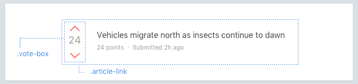

Nested components
================



```html
<div class='article-link'>
  <div class='vote-box article-link__vote-box'>
    ...
  </div>
  <h3 class='article-link__title'>...</h3>
  <p class='article-link__meta'>...</p>
</div>
```

Sometimes it's necessary to nest components. Here are some guidelines for doing that.

### Variants
A component may need to appear a certain way when nested in another component. Avoid modifying the nested component by reaching into it from the containing component.

```scss
.article-header {
  > .vote-box > .up { /* ✖️ avoid this */ }
}
```

  Instead, prefer to add a variant to the nested component and apply it from the containing component.

```html
<div class='article-header'>
  <div class='vote-box vote-box--highlight'>
    ...
  </div>
  ...
</div>
```

```scss
/* ✔️ better */
.vote-box--highlight .vote-box__up-vote { /* ... */ }
```

### Avoid `@extends`
Sometimes, when nesting components, your markup can get busy:

```html
<div class='search-form'>
  <input class='search-form__input' type='text'>
  <button class='search-button search-button--red search-button--large'></button>
</div>
```

Resist the urge to simplify this by using your CSS preprocessor's `@extend` mechanism:

```html
<div class='search-form'>
  <input class='input' type='text'>
  <button class='submit'></button>
</div>
```

```scss
/* ✖️ Bad */
.search-form {
  > .submit {
    @extend .search-button;
    @extend .search-button--red;
    @extend .search-button--large;
  }
}
```

This results in problems like:

* descision paralysis when it comes time to extend `search-button`... will changing it break `search-form`?
* Searching for `.search-button`

Moral of the story is: Don't use `@extends`.

What about repeating elements like lists? Learn about Layouts.
[Continue →](layouts.md)
<!-- {p:.pull-box} -->
