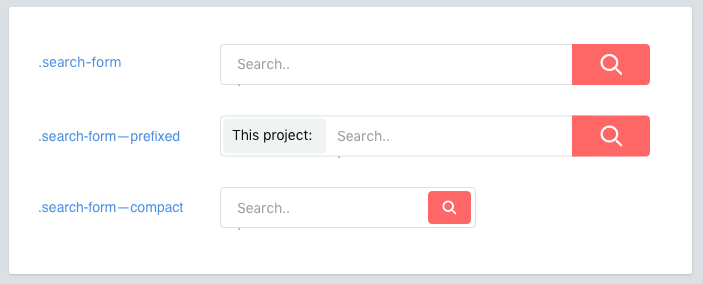

# Variants

Components may have variants. Elements may have variants, too.



<br>

## Naming variants
Classnames for variants will be prefixed by a double dash (`--`).

  ```scss
  .like-button { /* ... */ }
  .like-button--wide { /* ... */ }
  .like-button--short { /* ... */ }
  .like-button--disabled { /* ... */ }
  ```

## Element variants
Elements may also have variants.

  ```scss
  .shopping-card { /* ... */ }
  .shopping-card__title { /* ... */ }
  .shopping-card__title--small { /* ... */ }
  ```

## Dash prefixes
Double dashes are the preferred prefix for variants.

  * It prevents ambiguity with elements.
  * It highlights that the class name is a variant and also requires the base element class.
  * A CSS class can only start with a letter.


How do you deal with complex elements? Nest them.
[Continue →](nested-components.md)
<!-- {p:.pull-box} -->
